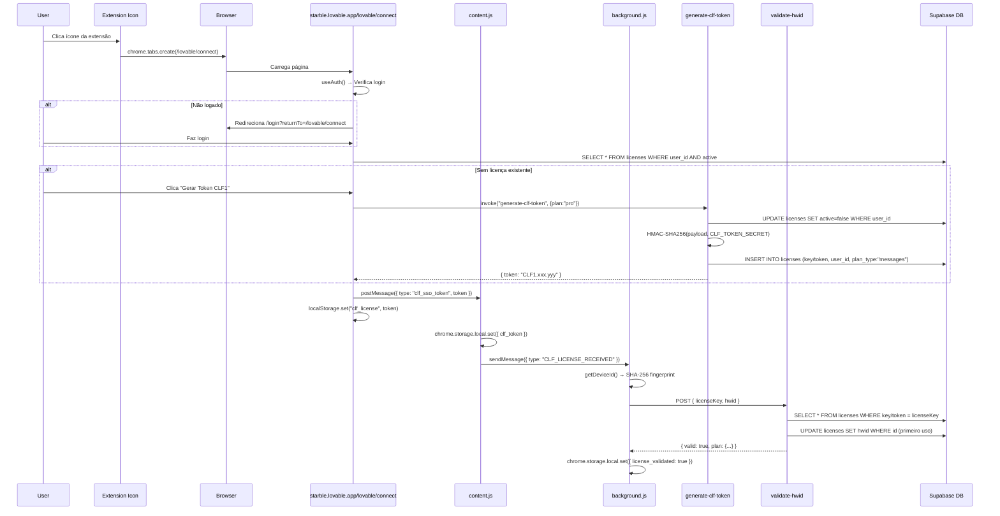
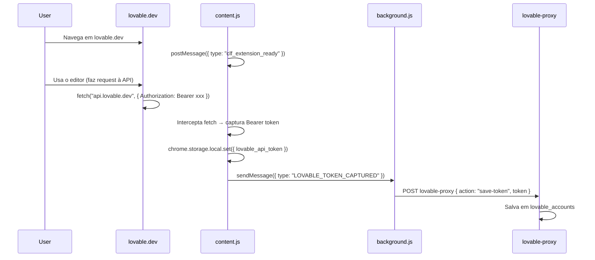
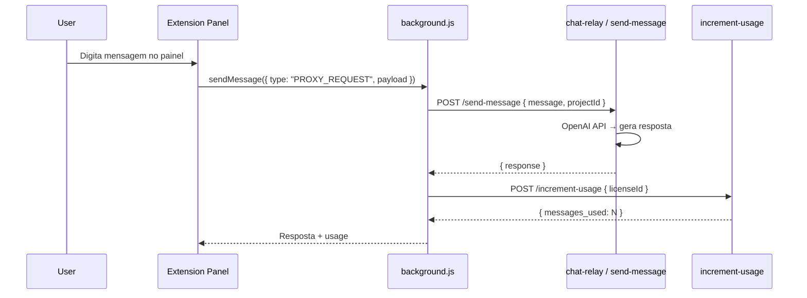

# Starble — Referência Técnica Completa

> Última atualização: 2026-02-27 14:00 BRT

---

## Sumário

1. [Projeto Supabase](#1-projeto-supabase)
2. [Todos os Endpoints (Edge Functions)](#2-todos-os-endpoints)
3. [Schema do Banco de Dados](#3-schema-do-banco-de-dados)
4. [Token CLF1 — Ciclo de Vida Completo](#4-token-clf1)
5. [Extensão Chrome — Arquitetura](#5-extensão-chrome)
6. [SSO Bridge — Todos os Canais](#6-sso-bridge)
7. [Interceptação de Tokens Lovable](#7-interceptação-de-tokens-lovable)
8. [Variáveis de Ambiente](#8-variáveis-de-ambiente)
9. [Fluxos Completos (Diagramas)](#9-fluxos-completos)
10. [Problemas Conhecidos](#10-problemas-conhecidos)

---

## 1. Projeto Supabase

| Dado               | Valor                                                         |
| ------------------ | ------------------------------------------------------------- |
| **Project ID**     | `qlhhmmboxlufvdtpbrsm`                                        |
| **URL**            | `https://qlhhmmboxlufvdtpbrsm.supabase.co`                    |
| **Functions Base** | `https://qlhhmmboxlufvdtpbrsm.supabase.co/functions/v1`       |
| **Anon Key**       | `eyJhbGciOiJIUzI1NiIs...` (JWT, role: anon)                   |
| **Dashboard**      | `https://supabase.com/dashboard/project/qlhhmmboxlufvdtpbrsm` |
| **Frontend URL**   | `https://starble.lovable.app`                                 |

### URLs acessadas pela extensão

```
https://qlhhmmboxlufvdtpbrsm.supabase.co/functions/v1/validate-hwid
https://qlhhmmboxlufvdtpbrsm.supabase.co/functions/v1/lovable-proxy
https://qlhhmmboxlufvdtpbrsm.supabase.co/functions/v1/notes-sync
https://qlhhmmboxlufvdtpbrsm.supabase.co/functions/v1/generate-clf-token (via frontend)
```

---

## 2. Todos os Endpoints

### Funções de Licença / Auth / Token

| Função                                                                                         | Método | Auth          | Entrada                | Saída                                      |
| ---------------------------------------------------------------------------------------------- | ------ | ------------- | ---------------------- | ------------------------------------------ |
| **[validate-hwid](file:///c:/codeloveai/supabase/functions/validate-hwid/index.ts)**           | POST   | ❌ (público)  | `{ licenseKey, hwid }` | `{ valid, plan, name, email }`             |
| **[generate-clf-token](file:///c:/codeloveai/supabase/functions/generate-clf-token/index.ts)** | POST   | ✅ Bearer JWT | `{ plan, expiresIn }`  | `{ token, expires_at, plan, email, name }` |
| [validate-license](file:///c:/codeloveai/supabase/functions/validate-license/index.ts)         | POST   | ❌            | `{ token }`            | `{ valid, error }`                         |
| [validate](file:///c:/codeloveai/supabase/functions/validate/index.ts)                         | POST   | ❌            | `{ token }`            | `{ valid }`                                |
| [auth-bridge](file:///c:/codeloveai/supabase/functions/auth-bridge/index.ts)                   | POST   | ✅            | `{ action }`           | Varies                                     |
| [activate-free-plan](file:///c:/codeloveai/supabase/functions/activate-free-plan/index.ts)     | POST   | ✅            | `{}`                   | `{ success }`                              |
| [admin-token-actions](file:///c:/codeloveai/supabase/functions/admin-token-actions/index.ts)   | POST   | ✅ Admin      | `{ action, userId }`   | Varies                                     |

### Funções da Extensão / Proxy

| Função                                                                                           | Método | Auth      | Entrada                                                           | Saída            |
| ------------------------------------------------------------------------------------------------ | ------ | --------- | ----------------------------------------------------------------- | ---------------- |
| **[lovable-proxy](file:///c:/codeloveai/supabase/functions/lovable-proxy/index.ts)**             | POST   | ✅ Bearer | `{ route, method, payload }` ou `{ action, token, refreshToken }` | Proxied response |
| [lovable-projects-sync](file:///c:/codeloveai/supabase/functions/lovable-projects-sync/index.ts) | POST   | ✅        | `{}`                                                              | `{ projects }`   |
| [lovable-token-refresh](file:///c:/codeloveai/supabase/functions/lovable-token-refresh/index.ts) | POST   | ✅        | `{ refreshToken }`                                                | `{ token }`      |

### Funções de Chat / Mensagens

| Função                                                                                 | Método | Auth | Entrada                  | Saída                   |
| -------------------------------------------------------------------------------------- | ------ | ---- | ------------------------ | ----------------------- |
| [chat-relay](file:///c:/codeloveai/supabase/functions/chat-relay/index.ts)             | POST   | ✅   | `{ messages }`           | `{ response }`          |
| [send-message](file:///c:/codeloveai/supabase/functions/send-message/index.ts)         | POST   | ✅   | `{ message, projectId }` | `{ response }`          |
| [increment-usage](file:///c:/codeloveai/supabase/functions/increment-usage/index.ts)   | POST   | ✅   | `{ licenseId }`          | `{ messages_used }`     |
| [get-user-context](file:///c:/codeloveai/supabase/functions/get-user-context/index.ts) | POST   | ✅   | `{}`                     | `{ user, plan, usage }` |
| [loveai-brain](file:///c:/codeloveai/supabase/functions/loveai-brain/index.ts)         | POST   | ✅   | `{ messages }`           | `{ response }`          |

### Funções de Pagamento

| Função                                                                                                       | Método | Auth       |
| ------------------------------------------------------------------------------------------------------------ | ------ | ---------- |
| [create-checkout](file:///c:/codeloveai/supabase/functions/create-checkout/index.ts)                         | POST   | ✅         |
| [create-mp-preference](file:///c:/codeloveai/supabase/functions/create-mp-preference/index.ts)               | POST   | ✅         |
| [marketplace-checkout](file:///c:/codeloveai/supabase/functions/marketplace-checkout/index.ts)                | POST   | ✅         |
| [mercadopago-webhook](file:///c:/codeloveai/supabase/functions/mercadopago-webhook/index.ts)                 | POST   | ❌ Webhook |
| [mp-webhook](file:///c:/codeloveai/supabase/functions/mp-webhook/index.ts)                                   | POST   | ❌ Webhook |
| [create-white-label-checkout](file:///c:/codeloveai/supabase/functions/create-white-label-checkout/index.ts) | POST   | ✅         |

### Funções Administrativas / Outras

| Função                                                                                             | Método   | Auth     |
| -------------------------------------------------------------------------------------------------- | -------- | -------- |
| [admin-create-user](file:///c:/codeloveai/supabase/functions/admin-create-user/index.ts)           | POST     | ✅ Admin |
| [admin-test-endpoint](file:///c:/codeloveai/supabase/functions/admin-test-endpoint/index.ts)       | POST     | ✅ Admin |
| [auto-onboard](file:///c:/codeloveai/supabase/functions/auto-onboard/index.ts)                     | POST     | ✅       |
| [affiliate-enroll](file:///c:/codeloveai/supabase/functions/affiliate-enroll/index.ts)             | POST     | ✅       |
| [reward-post](file:///c:/codeloveai/supabase/functions/reward-post/index.ts)                       | POST     | ✅       |
| [tenant-topup](file:///c:/codeloveai/supabase/functions/tenant-topup/index.ts)                     | POST     | ✅       |
| [notes-sync](file:///c:/codeloveai/supabase/functions/notes-sync/index.ts)                         | POST/GET | ✅       |
| [link-preview](file:///c:/codeloveai/supabase/functions/link-preview/index.ts)                     | POST     | ❌       |
| [download-project](file:///c:/codeloveai/supabase/functions/download-project/index.ts)             | POST     | ✅       |
| [publish-project](file:///c:/codeloveai/supabase/functions/publish-project/index.ts)               | POST     | ✅       |
| [process-wl-setup](file:///c:/codeloveai/supabase/functions/process-wl-setup/index.ts)             | POST     | ✅       |
| [send-security-fix](file:///c:/codeloveai/supabase/functions/send-security-fix/index.ts)           | POST     | ✅       |
| [send-seo-fix](file:///c:/codeloveai/supabase/functions/send-seo-fix/index.ts)                     | POST     | ✅       |
| [supabase-migrate-start](file:///c:/codeloveai/supabase/functions/supabase-migrate-start/index.ts) | POST     | ✅       |
| [supabase-sync-cron](file:///c:/codeloveai/supabase/functions/supabase-sync-cron/index.ts)         | POST     | ✅       |

---

## 3. Schema do Banco de Dados

### Tabela `licenses`

> ⚠️ Colunas podem ter nomes antigos (`token`/`is_active`) ou novos (`key`/`active`) dependendo se a migration `20260223163000` foi aplicada.

```sql
CREATE TABLE public.licenses (
  id          UUID DEFAULT gen_random_uuid() PRIMARY KEY,
  token/key   TEXT NOT NULL UNIQUE,     -- CLF1.{payload}.{signature}
  user_id     UUID NOT NULL,
  plan        TEXT DEFAULT 'free',       -- 'free', 'pro', etc.
  plan_type   TEXT DEFAULT 'messages',   -- SOMENTE 'messages' ou 'hourly' (trigger check)
  expires_at  TIMESTAMPTZ,
  is_active/active BOOLEAN DEFAULT true,
  hwid        TEXT,                      -- SHA-256 fingerprint do device
  daily_messages INTEGER DEFAULT 100,
  hourly_limit   INTEGER DEFAULT 20,
  created_at  TIMESTAMPTZ DEFAULT now()
);
```

### Tabela `profiles`

```sql
CREATE TABLE public.profiles (
  id        UUID DEFAULT gen_random_uuid() PRIMARY KEY,
  user_id   UUID UNIQUE REFERENCES auth.users(id),
  email     TEXT,
  name      TEXT,
  avatar_url TEXT,
  created_at TIMESTAMPTZ DEFAULT now()
);
```

### Tabela `daily_usage`

```sql
CREATE TABLE public.daily_usage (
  id           UUID DEFAULT gen_random_uuid() PRIMARY KEY,
  license_id   UUID REFERENCES licenses(id),
  date         DATE DEFAULT CURRENT_DATE,
  messages_used INTEGER DEFAULT 0,
  UNIQUE(license_id, date)
);
```

### Tabela `lovable_accounts`

```sql
CREATE TABLE public.lovable_accounts (
  id               UUID DEFAULT gen_random_uuid() PRIMARY KEY,
  user_id          UUID REFERENCES auth.users(id),
  lovable_token    TEXT,
  refresh_token    TEXT,
  last_verified_at TIMESTAMPTZ,
  created_at       TIMESTAMPTZ DEFAULT now()
);
```

---

## 4. Token CLF1

### Formato

```
CLF1.{BASE64URL_PAYLOAD}.{HMAC_SHA256_SIGNATURE}
```

### Payload (decodificado)

```json
{
  "uid": "uuid-do-usuario",
  "email": "user@example.com",
  "plan": "pro",
  "exp": 1740000000000,
  "iat": 1708464000000,
  "v": 1
}
```

### Como é gerado

1. **Quem gera:** Edge Function `generate-clf-token`
2. **Secret:** `CLF_TOKEN_SECRET` (env var no Supabase)
3. **Algoritmo:** HMAC-SHA-256 → Base64URL
4. **Expiração padrão:** 365 dias
5. **Autenticação:** Requer Bearer JWT do Supabase (anon key + logged user)

### Onde é salvo

| Local                    | Campo                              | Detalhe           |
| ------------------------ | ---------------------------------- | ----------------- |
| **DB Supabase**          | `licenses.key` ou `licenses.token` | Persistente       |
| **chrome.storage.local** | `clf_token`                        | Na extensão       |
| **localStorage**         | `clf_license`, `clf_token`         | Na página Starble |

### Ciclo de vida

```
[User] → Clica "Gerar Token" → [Frontend LovableConnect.tsx]
  → supabase.functions.invoke("generate-clf-token", { plan: "pro" })
    → [Edge Function] verifica JWT → busca profile → gera CLF1
    → Desativa tokens antigos → INSERT licenses → retorna token
  ← { token: "CLF1.xxx.yyy", expires_at: "..." }
→ setClfToken() → useEffect dispara → pushes para extensão (3 canais)
```

---

## 5. Extensão Chrome — Arquitetura

### Manifest V3

```json
{
  "manifest_version": 3,
  "name": "Starble Extension",
  "permissions": ["storage", "activeTab", "webRequest"],
  "host_permissions": [
    "https://*.lovable.app/*",
    "https://*.lovableproject.com/*",
    "https://*.lovable.dev/*",
    "https://lovable.dev/*"
  ],
  "content_scripts": [
    {
      "matches": [
        "https://*.lovable.app/*",
        "https://*.lovableproject.com/*",
        "https://*.lovable.dev/*"
      ],
      "js": ["content.js"],
      "run_at": "document_idle"
    }
  ]
}
```

### Arquivos

| Arquivo                                                        | Tamanho | Função                                           |
| -------------------------------------------------------------- | ------- | ------------------------------------------------ |
| [background.js](file:///c:/codeloveai/extension/background.js) | 7.7KB   | Service Worker — routing, SSO, proxy, validation |
| [content.js](file:///c:/codeloveai/extension/content.js)       | 21KB    | Injection — interception, panel, SSO capture     |
| [manifest.json](file:///c:/codeloveai/extension/manifest.json) | 789B    | Config                                           |
| [panel/](file:///c:/codeloveai/extension/panel/)               | —       | UI do painel lateral                             |

### chrome.storage.local — Chaves usadas

| Chave                      | Tipo       | Descrição                          |
| -------------------------- | ---------- | ---------------------------------- |
| `clf_token`                | string     | Token CLF1 ativo (licença Starble) |
| `clf_email`                | string     | Email do usuário Starble           |
| `clf_name`                 | string     | Nome do usuário                    |
| `clf_license_at`           | ISO string | Quando o CLF1 foi recebido         |
| `lovable_api_token`        | string     | Bearer token Firebase do Lovable   |
| `lovable_refresh_token`    | string     | Firebase refresh token             |
| `lovable_token_history`    | array      | Últimos 20 tokens capturados       |
| `lovable_token_updated_at` | ISO string | Última atualização                 |
| `license_validated`        | boolean    | Se licença foi validada            |
| `license_validated_at`     | ISO string | Quando                             |
| `deviceId`                 | string     | SHA-256 fingerprint (32 chars)     |
| `panelOpen`                | boolean    | Estado do painel                   |
| `interceptMode`            | string     | Modo de interceptação              |
| `platformUrl`              | string     | Base URL do Supabase functions     |

---

## 6. SSO Bridge — Todos os Canais de Comunicação

### 6.1. postMessage Types (window ↔ content.js)

| Type                        | Direção      | Payload                                      | Descrição                    |
| --------------------------- | ------------ | -------------------------------------------- | ---------------------------- |
| `clf_extension_ready`       | content→page | `{}`                                         | Extensão carregou            |
| `clf_ping`                  | page→content | `{}`                                         | Detecta extensão             |
| `clf_pong`                  | content→page | `{}`                                         | Resposta ao ping             |
| `clf_sso_login`             | page→content | `{ token, email, name }`                     | Login SSO                    |
| `clf_sso_logout`            | page→content | `{}`                                         | Logout SSO                   |
| `clf_sso_token`             | page→content | `{ token: "CLF1.xxx" }`                      | **Push CLF1 para extensão**  |
| `clf_token_bridge`          | content↔page | `{ idToken, refreshToken, source, version }` | Bridge de token Lovable      |
| `clf_request_lovable_token` | page→content | `{}`                                         | Pede token Lovable capturado |
| `clf_lovable_token`         | content→page | `{ token }`                                  | Resposta com token Lovable   |
| `clf_lovable_token_missing` | content→page | `{}`                                         | Sem token capturado          |

### 6.2. chrome.runtime.sendMessage Types (content.js ↔ background.js)

| Type                      | Direção    | Payload                                             | Retorno                                            |
| ------------------------- | ---------- | --------------------------------------------------- | -------------------------------------------------- |
| `PROXY_REQUEST`           | content→bg | `{ payload: { route, method, body, supabaseJwt } }` | Proxied response                                   |
| `GET_AUTH`                | any→bg     | `{}`                                                | `{ clf_token, clf_email, lovable_api_token, ... }` |
| `LOVABLE_TOKEN_CAPTURED`  | content→bg | `{ token, refreshToken }`                           | `{ ok: true }`                                     |
| `AUTO_SAVE_LOVABLE_TOKEN` | content→bg | `{ lovableToken, refreshToken, supabaseJwt }`       | `{ success }` or `{ error }`                       |
| `SYNC_NOTES`              | any→bg     | `{ notes, folders }`                                | `{ success }` or `{ error }`                       |
| `GET_NOTES`               | any→bg     | `{}`                                                | `{ notes }`                                        |
| `CLF_LICENSE_RECEIVED`    | content→bg | `{ token: "CLF1.xxx" }`                             | `{ ok: true }`                                     |

### 6.3. CustomEvent (document-level)

| Event Name         | Detalhe                     | Descrição                  |
| ------------------ | --------------------------- | -------------------------- |
| `clf_token_bridge` | `{ idToken, refreshToken }` | Alternativa ao postMessage |

### 6.4. Como o CLF1 chega da página à extensão (3 canais simultâneos)

```
[LovableConnect.tsx] — useEffect(clfToken)
  │
  ├─ Canal 1: window.postMessage({ type: "clf_sso_token", token })
  │            → content.js captura → chrome.storage.local.set({ clf_token })
  │            → chrome.runtime.sendMessage({ type: "CLF_LICENSE_RECEIVED" })
  │            → background.js → validateLicense() → validate-hwid Edge Function
  │
  ├─ Canal 2: localStorage.setItem("clf_license", token)
  │            → content.js pollerInterval (cada 500ms, 30s max)
  │            → chrome.storage.local.set({ clf_token })
  │            → Remove localStorage key após captura
  │
  └─ Canal 3: StorageEvent dispatch
               → Qualquer listener de storage no mesmo origin
```

---

## 7. Interceptação de Tokens Lovable

### O que a extensão intercepta

A extensão captura automaticamente o **Firebase ID Token** que o Lovable usa para autenticar chamadas à sua API. Isso acontece de 2 formas:

### 7.1. Interceptação de `fetch()`

```javascript
// content.js sobrescreve window.fetch
window.fetch = function (...args) {
  const url = args[0];
  if (url.includes("api.lovable.dev") || url.includes("lovable.dev")) {
    const authHeader = headers["authorization"];
    if (authHeader.startsWith("Bearer ")) {
      capturedLovableToken = authHeader.replace("Bearer ", "");
      // Salva em chrome.storage + notifica background
    }
  }
  return origFetch(...args);
};
```

### 7.2. Interceptação de `XMLHttpRequest`

```javascript
// content.js também sobrescreve XHR
XMLHttpRequest.prototype.setRequestHeader = function (name, value) {
  if (url.includes("api.lovable.dev") && name === "authorization") {
    capturedLovableToken = value.replace("Bearer ", "");
    // Salva + notifica
  }
  return origXHRSetHeader(name, value);
};
```

### 7.3. Extração do Refresh Token (localStorage)

A extensão lê o refresh token do localStorage do Lovable procurando 3 padrões:

| Padrão        | Chave localStorage                              | Campo                               |
| ------------- | ----------------------------------------------- | ----------------------------------- |
| Firebase Auth | `firebase:authUser:{API_KEY}:[DEFAULT]`         | `.spiTokenManager.refreshToken`     |
| Supabase Auth | `sb-{ref}-auth-token`                           | `.refresh_token`                    |
| Genérico      | qualquer chave com "auth"/"firebase"/"supabase" | `.refresh_token` ou `.refreshToken` |

### 7.4. O que acontece com o token capturado

```
Token capturado (fetch/XHR)
  → setCurrentLovableToken(token)
    → Arquiva token anterior em lovable_token_history (max 20)
    → chrome.storage.local.set({ lovable_api_token: token })
  → notifyPlatformToken(token, refreshToken)
    → chrome.runtime.sendMessage({ type: "LOVABLE_TOKEN_CAPTURED" })
      → background.js → autoSaveLovableToken()
        → POST /functions/v1/lovable-proxy { action: "save-token", token, refreshToken }
          → Salva na tabela lovable_accounts
```

---

## 8. Variáveis de Ambiente

### Frontend (.env)

| Variável                        | Descrição               |
| ------------------------------- | ----------------------- |
| `VITE_SUPABASE_URL`             | URL do projeto Supabase |
| `VITE_SUPABASE_PUBLISHABLE_KEY` | Anon key JWT            |
| `VITE_SUPABASE_PROJECT_ID`      | Project ID              |

### Edge Functions (Deno.env — Supabase Dashboard → Settings → Edge Functions)

| Variável                    | Usada em                                    | Descrição                                  |
| --------------------------- | ------------------------------------------- | ------------------------------------------ |
| `SUPABASE_URL`              | Todas                                       | Auto-injetada pelo Supabase                |
| `SUPABASE_ANON_KEY`         | generate-clf-token                          | Auto-injetada                              |
| `SUPABASE_SERVICE_ROLE_KEY` | validate-hwid, generate-clf-token, admin-\* | Auto-injetada                              |
| `CLF_TOKEN_SECRET`          | generate-clf-token                          | **Manual** — HMAC secret para assinar CLF1 |
| `OPENAI_API_KEY`            | chat-relay, send-message, loveai-brain      | Para IA                                    |
| `LOVABLE_API_TOKEN`         | lovable-proxy, lovable-projects-sync        | Para API Lovable                           |
| `MERCADOPAGO_ACCESS_TOKEN`  | mercadopago-webhook, create-mp-preference   | Pagamentos                                 |

### Extensão (hardcoded em background.js)

| Constante              | Valor                                                   |
| ---------------------- | ------------------------------------------------------- |
| `DEFAULT_PLATFORM_URL` | `https://qlhhmmboxlufvdtpbrsm.supabase.co/functions/v1` |
| URL ao clicar ícone    | `https://starble.lovable.app/lovable/connect`           |

---

## 9. Fluxos Completos

### 9.1. Primeiro Uso (SSO Bridge)



### 9.2. Uso Normal (Extensão já autenticada)



### 9.3. Chat via Extensão



---

## 10. Problemas Conhecidos

### ⚠️ Colunas da tabela `licenses`

A migration `20260223163000` renomeia `token→key` e `is_active→active`, mas **pode NÃO ter sido aplicada** ao banco real. Todas as Edge Functions tentam ambas as variações.

### ⚠️ Trigger `plan_type`

Trigger `trg_validate_license_plan_type` rejeita qualquer INSERT/UPDATE onde `plan_type` não seja `'messages'` ou `'hourly'`. Versões antigas do código usavam `plan_type: "pro"` que era **silenciosamente rejeitado**.

### ⚠️ Edge Functions podem não estar deployadas

O Lovable nem sempre auto-deploya Edge Functions após `git push`. Verifique no Dashboard:

- `https://supabase.com/dashboard/project/qlhhmmboxlufvdtpbrsm/functions`
- Cada função deve estar listada e com status "Active"

### ⚠️ `CLF_TOKEN_SECRET` pode não estar configurada

Se a variável `CLF_TOKEN_SECRET` não existir nos secrets do Supabase, `generate-clf-token` retorna erro 500. Configure em:

- Dashboard → Settings → Edge Functions → Secrets

---

## 11. Marketplace de Projetos (Store)

> Adicionado: 2026-02-27

### Visão Geral

Sistema de compra e venda de projetos/templates com pagamento via Mercado Pago e split automático.

### Comissão & Split

| Destinatário | Percentual |
|---|---|
| Plataforma (Starble) | **30%** |
| Vendedor | **70%** |

O comprador paga o valor cheio do projeto. As taxas de maquininha (Mercado Pago) são descontadas do comprador, e a comissão da plataforma é descontada do valor líquido.

### Edge Function: `marketplace-checkout`

- **Método:** POST
- **Auth:** ✅ Bearer JWT
- **Entrada:** `{ listing_id, payment_method?: "pix" }`
- **Saída (PIX):** `{ pix_code, pix_qr_base64, payment_id, purchase_id, price, commission, seller_receives }`
- **Saída (Cartão):** `{ init_point, purchase_id, price, commission, seller_receives }`

### Fluxo de Compra

```
1. Comprador → marketplace-checkout (PIX ou Cartão)
2. Edge Function → Cria registro em marketplace_purchases (status: "pending")
3. Edge Function → Cria pagamento/preferência no Mercado Pago
4. MP webhook → Atualiza marketplace_purchases.status → "paid"
5. Vendedor recebe 70% automaticamente
```

### Rotas Frontend

| Rota | Componente | Descrição |
|---|---|---|
| `/store` | MarketplaceLanding | Landing page pública da loja |
| `/marketplace` | Marketplace | Catálogo com filtros e busca |
| `/marketplace/vender` | MarketplaceSell | Gestão de catálogo do vendedor |
| `/marketplace/:slug` | MarketplaceDetail | Detalhe e compra do projeto |

### UI/UX

- Design "Liquid Glass Dark" com botões grandes (h-14, rounded-2xl)
- Categorias em scroll horizontal com gradientes por tipo
- Barra unificada: busca + filtro + subcategorias numa mesma seção
- TopProjectsBanner: banner rotativo com projetos em destaque da comunidade
- Cards com preview de imagem, stats (views, sales, rating) e seller info

---

## 12. Editor de Projetos — Sincronização em Tempo Real

> Adicionado: 2026-02-27

### Detecção de Conclusão via `update.md`

O venus-chat injeta uma instrução para que a IA atualize `src/update.md` com timestamp ao concluir cada tarefa. O editor faz polling desse arquivo a cada 5 segundos.

### Cache-Bust do Preview

Quando uma atualização é detectada, o iframe de preview é recarregado com `?_cb={Date.now()}`, forçando o navegador a buscar a versão mais recente (equivalente a Ctrl+Shift+R).

### Persistência de Chat

O histórico de mensagens do editor é salvo em `localStorage` por projeto (`starble_chat_{projectId}`), preservando até 100 mensagens entre reloads.

---

## 13. Marketplace — Onboarding & Sistema de Faturas

> Adicionado: 2026-02-27

### Fluxo de Venda Segura (5 Etapas)

1. **Início do Onboarding** — Vendedor inicia apresentação guiada
2. **Demonstração & Dúvidas** — Vendedor demonstra funcionalidades
3. **Acesso como Visualizador** — Vendedor duplica projeto e adiciona comprador como Viewer
4. **Confirmação do Projeto** — Comprador confirma que o projeto é o mesmo do anúncio (com checkbox de aceite)
5. **Liberação do Pagamento** — Comprador libera valor ao vendedor (irreversível, com termos CDC)

### Tabelas Envolvidas
- `marketplace_onboarding` — Sessão de onboarding por compra
- `marketplace_onboarding_steps` — Log de cada etapa concluída
- `marketplace_seller_invoices` — Faturas com hold de 7 dias
- `marketplace_location_log` — Registro de localização (consentimento obrigatório)

### Regras de Pagamento
- **Hold de 7 dias** após confirmação de entrega pelo comprador
- **Comissão de 30%** retida pela plataforma
- **Vendedor recebe 70%** via fatura automática
- Fatura criada automaticamente no checkout (PIX/card/gratuito)

### Proteções Anti-Fraude
- Localização ao vivo obrigatória para transações
- IP e user-agent registrados
- Avisos sobre pagamentos externos (plataforma não se responsabiliza)
- Termos CDC para produtos digitais (sem devolução após acesso)
- Monitoramento de todas as transações

### Regras CDC (Código de Defesa do Consumidor)
- Art. 49: Direito de arrependimento não se aplica a produtos digitais após acesso integral
- Prestação de serviço concluída após onboarding completo
- Aceite expresso obrigatório antes da liberação de pagamento
- Impossibilidade de devolução de valores após confirmação
